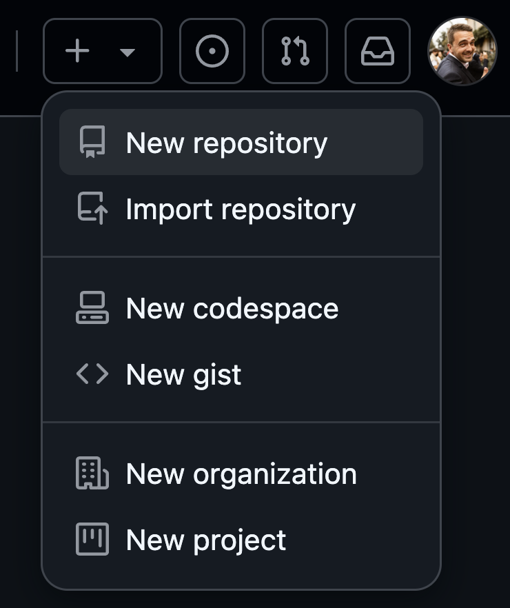
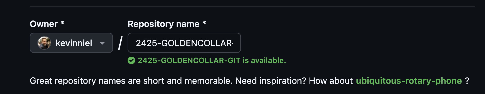
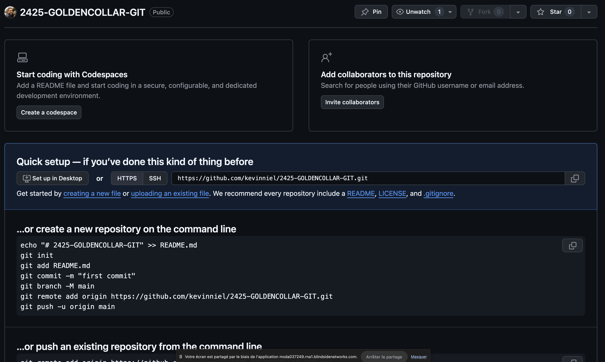

# GIT

## Rappels / Définitions

- Un repository (repo) est un dossier dans lequel on travaille avec GIT, et donc qui contient un dossier `.git`
- Tout ce qui est indexé est destiné à être sauvegardé !
- A chaque fois que vous avez réalisé une avancée, vous **DEVEZ** commit
- Pour travailler à distance, il faut un repo distant avec lequel communiquer. C'est ce que vous créez sur github ou gitlab.
- Un **conflit** est un cas de figure où git ne sait pas gérer les modifications apportées à un même fichier. Vous devrez donc gérer ce que vous gardez ou non vous-même, et refaire un `add, commit, push` pour que les modifications soient prises en compte !

## Commandes de base pour travailler en _local_

- `git init` : pemet de transformer un dossier en repository
- `git status` : permet de savoir où on en est dans le workfow GIT
- `git add <fichier>` : permet d'indexer un `<fichier>`. Astuce, pour tout indexer, remplacer `<fichier>` par `.`
- `git commit -m "message"` : permet de réaliser la sauvegarde du dernier état d'indexation
- `git log` : permet de voir l'historique des commits

## Travailler à _distance_

### Github

#### Créer un repo distant

1. Ajouter un nouveau repository

2. Renseignez le nom

3. Validez avec le bouton "create"

4. vous arrivez sur une page comme celle-ci :

5. Suivez les instructions disponibles sur github, pour savoir quoi faire

#### Commandes de base

- `git remote add origin REPO_URL` : permet de relier votre repo local à votre repo distant
- `git push` : Permet d'envoyer en ligne l'ensemble des commits disponibles en local
- `git push -u origin <branch>` : Lors du premier push sur sur une branche, il faut spécifier sur quelle branche on doit push.
- `git pull` : Permet de récupérer les commits distants en local

## Travailler avec les _branches_

- `git branch` : Permet de voir la liste des branches et savoir sur laquelle on est
- `git branch <nom_de_la_branche>` : Crée un branche
- `git checkout <nom_de_la_branche>` : Change la branche courante
- `git merge <nom_de_la_branche>` : Permet de fusionner la branche `nom_de_la_branche` avec la branche courante
